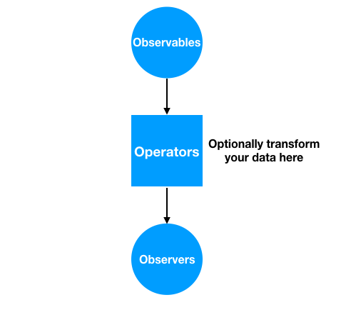
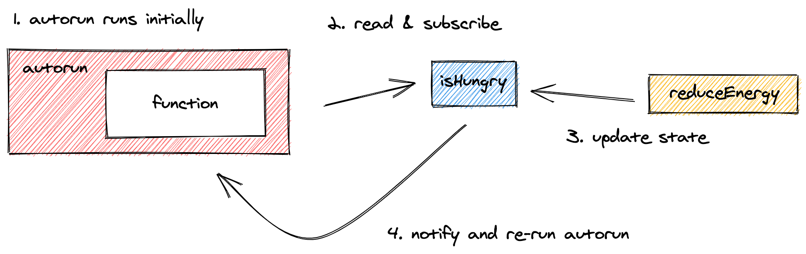

# 🚀 Design Tool

- [Recoil](https://github.com/Menchynskyi/design-tool/tree/recoil)
- [MobX](https://github.com/Menchynskyi/design-tool/tree/mobx)
- [MobX-State-Tree](https://github.com/Menchynskyi/design-tool/tree/mobx-state-tree)
- [Redux Toolkit](https://github.com/Menchynskyi/design-tool/tree/redux-toolkit)
- [Zustand](https://github.com/Menchynskyi/design-tool/tree/zustand)
- [RxJS](https://github.com/Menchynskyi/design-tool/tree/rxjs)

# MobX

## Observable pattern



### Observable vs promise

- Observable can emit multiple values
- Observable is cancellable
- Observables are executed lazily
- Can define runtime execution of Observable

### Observer vs PubSub

| Pubsub                                                   | Observable & observer                               |
| -------------------------------------------------------- | --------------------------------------------------- |
| Mediator sends a message about events to its subscribers | Observable holds own state and notifies subscribers |
| One object can emit multiple types of events             | Can subscribe to one data stream                    |
| Communicates using events                                | Communicates emitting data                          |

## Core concepts of MobX and MST

### Models

\***\*tree = type + state\*\***

Each node in the tree is described by two things: its type (the shape of the thing) and its data (the state it is currently in)

```tsx
import { types } from 'mobx-state-tree';

const Element = types.model('Element', { color: types.string });

const elementStore = Element.create({ color: '#fff' });
```

In MST every node in the tree is a tree in itself. Trees can be composed by composing their types:

```tsx
const ElementStore = types.model('ElementStore', {
  elements: types.array(Element),
});

const storeInstance = ElementStore.create({
  elements: [{ color: '#fff' }],
});
```

### Actions

By default, nodes can only be modified by actions

```tsx
const Element = types
  .model('Element', {
    color: types.string,
  })
  .actions((self) => ({
    editColor(color: string) {
      self.color = color;
    },
  }));
```

#### Limitations and rules

- Trying to modify a node without using an action will throw an exception in MST. In MobX can be customized via `enforceActions` setting.
- Actions can only modify models that belong to the (sub)tree on which they are invoked.
- Use `self` instead `this` inside actions.

### Views

Views is derived computed value. Based on the [computed](https://mobx.js.org/computeds.html) concept in MobX. They are like selectors in Redux

```tsx
const ElementStore = types
  .model('ElementStore', {
    elements: types.array(Element),
  })
  .views((self) => ({
    get filteredElements() {
      return self.elements.filter(filterFunc);
    },
  }));
```

### Listening to observables, snapshots, patches and actions

#### Lifecycle hooks

```tsx
types
  .model('Todo', { done: true })
  .preProcessSnapshot((snapshot) => ({
    // auto convert strings to booleans as part of preprocessing
    done:
      snapshot.done === 'true'
        ? true
        : snapshot.done === 'false'
        ? false
        : snapshot.done,
  }))
  .actions((self) => ({
    afterCreate() {
      console.log('Created a new todo!');
    },
  }));
```

#### Reactions

Mobx offers an opportunity to attach listeners of observable state that automatically run side effects whenever something relevant changes.



`autorun` runs on every change of the state.

```jsx
autorun(() => {
  console.log(storeInstance.selectedTodo.title);
});
```

`reaction` runs if a tracked observable is changed

```jsx
import { reaction, observable } from 'mobx';

const todos = observable([{ title: 'eat' }, { title: 'drink' }]);

reaction(
  () => todos.map((todo) => todo.title),
  (titles) => console.log(titles.join(', ')),
);

todos.push({ title: 'sleep' });
```

`when` runs if predicate returns true

```jsx
import { when, makeAutoObservable } from 'mobx';

class MyResource {
  constructor() {
    makeAutoObservable(this, { dispose: false });
    when(
      () => !this.isVisible,
      () => this.dispose(),
    );
  }

  get isVisible() {}

  dispose() {}
}
```

`onSnapshot` returns all state after update

```jsx
onSnapshot(storeInstance, (newSnapshot) => {
  console.info('Got new snapshot:', newSnapshot);
});
```

`onPatch` returns changed data after update

```jsx
onPatch(storeInstance, (patch) => {
  console.info('Got change: ', patch);
});
```

`onAction`

```tsx
onAction(storeInstance, (call) => {
  console.info('Action was called:', call);
});

storeInstance.todos[0].setTitle('Add milk');

/*
prints:
{
	path: "/todos/0",
	name: "setTitle",
	args: ["Add milk"]
}
*/
```

#### Middlewares

`addMiddleware` intercepts actions before they are applied:

```tsx
addMiddleware(storeInstance, (call, next) => {
  call.args[0] = call.args[0].replace(/tea/gi, 'Coffee');
  return next(call);
});
```

## React integration

1. `mobx-react-lite` doesn't support class components and observable PropTypes.
2. for injection of a global store use `useContext`.

## React updates vs MobX updates

**Important:** MobX reacts to any existing observable property that is read during the execution of a tracked function.

- React batches series of state updates
- For useEffect we don't need to specify dependencies if an observable is used:

```jsx
import { useState } from 'react';
import { observer, useLocalObservable } from 'mobx-react-lite';

const TimerView = observer(() => {
  const timer = useLocalObservable(() => ({
    secondsPassed: 0,
    increaseTimer() {
      this.secondsPassed++;
    },
  }));

  useEffect(() => {
    autorun(() => {
      if (timer.secondsPassed > 60) {
        alert("Still there. It's a minute already?!!");
      }
    });
  }, []);

  useEffect(() => {
    const handle = setInterval(timer.increaseTimer, 1000);

    return () => {
      clearInterval(handle);
    };
  }, []);

  return <span>Seconds passed: {timer.secondsPassed}</span>;
});

ReactDOM.render(<TimerView />, document.body);
```

- render callbacks aren't reactive:

```jsx
const TodoView = observer(({ todo }) => {
  // WRONG: GridRow.onRender won't pick up changes in todo.title / todo.done
  return <GridRow onRender={() => <td>{todo.title}</td>} />;

  // CORRECT: wrap the callback rendering in Observer to be able to detect changes.
  return (
    <GridRow
      onRender={() => <Observer>{() => <td>{todo.title}</td>}</Observer>}
    />
  );
});
```

## Resources

- [Observables vs promises](https://betterprogramming.pub/observables-vs-promises-which-one-should-you-use-c19aef53c680)
- [Observer vs PubSub](https://habr.com/ru/post/270339/)
- [Batch updates in React](https://blog.logrocket.com/simplifying-state-management-in-react-apps-with-batched-updates/)
- [Why react is not reactive](https://www.swyx.io/reactrally/)
- Demo [MobX](https://github.com/Menchynskyi/design-tool/tree/mobx), [MST](https://github.com/Menchynskyi/design-tool/tree/mobx-state-tree), [MST async](https://github.com/Menchynskyi/design-tool/tree/mst-async-example)
